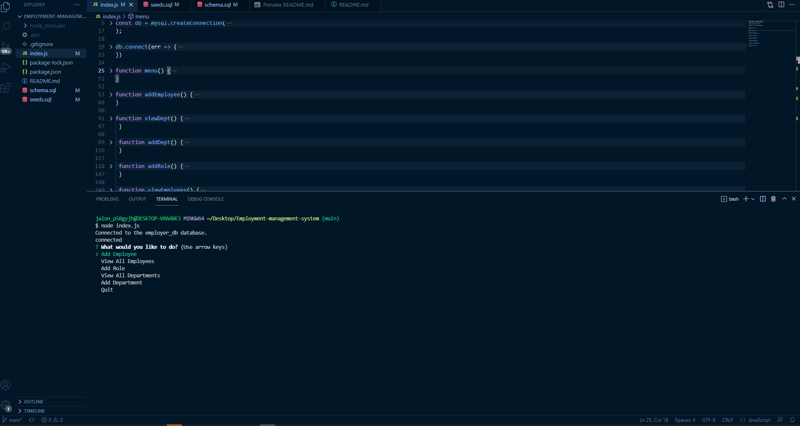

# Employment Management System
  
  ## Description
  GIVEN a command-line application that accepts user input
  
  WHEN I start the application
  
  THEN I am presented with the following options: view all departments, view all roles, view all employees, add a department, add a role, add an employee, and update an employee role
  
  WHEN I choose to view all departments
  
  THEN I am presented with a formatted table showing department names and department ids
  
  WHEN I choose to view all roles
  
  THEN I am presented with the job title, role id, the department that role belongs to, and the salary for that role
  
  WHEN I choose to view all employees
  
  THEN I am presented with a formatted table showing employee data, including employee ids, first names, last names, job titles, departments, salaries, and managers that the employees report to
  
  WHEN I choose to add a department
  
  THEN I am prompted to enter the name of the department and that department is added to the database
  
  WHEN I choose to add a role
  
  THEN I am prompted to enter the name, salary, and department for the role and that role is added to the database
  
  WHEN I choose to add an employee
  
  THEN I am prompted to enter the employee’s first name, last name, role, and manager, and that employee is added to the database
  
  WHEN I choose to update an employee role
  
  THEN I am prompted to select an employee to update and their new role and this information is updated in the database 
  
  ## Table of Contents
  - [Installation](#installation)
  - [Usage](#usage)
  - [Contributing](#contributing)
  - [Tests](#tests)
  - [Questions](#questions)
  
  ## Installation
  npm inquirer, npm mysql2, npm console.table, and npm dotenv are all needed for this application to function correctly.
 
  ## Usage
  AS A business owner
  
  I WANT to be able to view and manage the departments, roles, and employees in my company
  
  SO THAT I can organize and plan my business

  ---
  
  The following is a gif to show the functionality of the app:

  
  
  ---
  ## Contributing 
  At this time there are no other contributors on this project.
  
  ## Tests
  At this time there are no tests for this application
 
  ## Questions
  If you have any further questions about my application, please feel free to contact me using the infromation below:
  jalontuttle
  jalontuttle@gmail.com